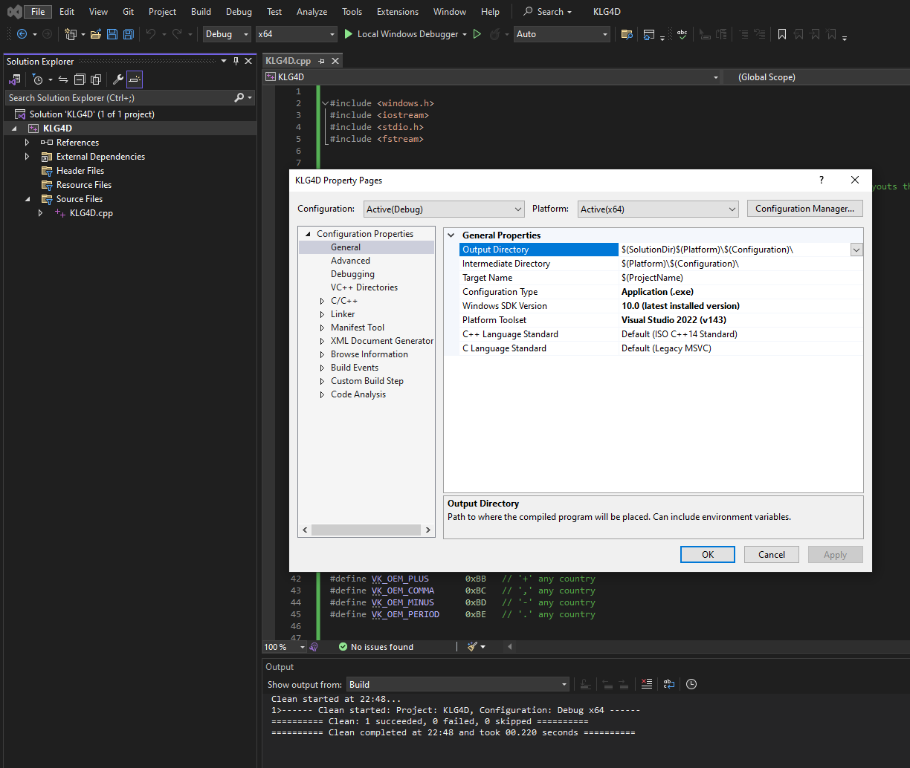

# Keylogger 4 dummies
A simple key logger written in C++ with Visual Studio 2022 solution (.sln) to help you traceback your work. Configure it according to your keyboard and OS then recompile it.

## Executable
A compiled executable for Win_x64 can be found in [compiled_v0.1_KLG4D.zip](./compiled_x64_windows) . To run it on any other OS, you will have to reconfigure the solution.

## Visual Studio Solution
- Install Visual Studio Community from https://visualstudio.microsoft.com/vs/community/
- Clone this repo to a local directory.
- Open the solution file in Visual Studio: [KLG4D.sln](./KLG4D) 
- Edit the code in [KLG4D.cpp](./KLG4D/KLG4D/KLG4D.cpp) 
- Build.

## Safe Use
Use it responsibly and with caution on your own personal computer. Keyloggers attract the attention of intelligent anti-viruses therefore avoid adding any suspicious of code to it. To avoid raising red flags, here are a few tips:
- Avoid using timestamps, user or system variables (e.g., PC name, IP, mac-addresses).
- Avoid reading registery keys.
- Avoid start-up runs or self-copying.
- Avoid using random generators.

